# Azure Storage Security Assessment

## Project Overview

This project documents a hands-on security assessment and hardening exercise performed against a Microsoft Azure Storage account. The objective was to review the resource from a security and governance perspective, identify weaknesses, apply selected remediations, and validate the resulting security posture with evidence.

The assessment focuses on network exposure, identity and access management, data protection, encryption, monitoring, threat protection, and resource governance.

## Environment

| Component | Details |
| --- | --- |
| Cloud platform | Microsoft Azure |
| Resource | Azure Storage Account — StorageV2 / General Purpose v2 |
| Resource group | `RG-SecurityLab` |
| Region | Southeast Asia |
| Assessment method | Azure Portal configuration review, risk analysis, remediation, and verification |

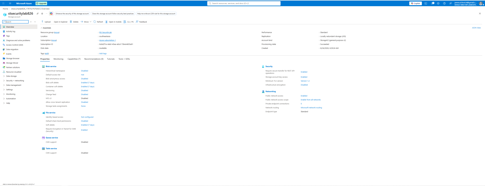

## Executive Findings Summary

| Finding | Risk | Status |
| --- | --- | --- |
| Public network access allowed from all networks | Medium | Remediated |
| Shared Key authorization enabled | Medium | Remediated |
| Microsoft Entra authorization not set as portal default | Low–Medium | Remediated |
| Blob versioning disabled | Medium | Remediated |
| Subscription-level Owner privilege inherited | High | Documented / not changed in lab |
| Infrastructure encryption disabled | Low | Documented |
| Microsoft Defender for Storage disabled | Medium | Recommended / not enabled due to cost |
| Diagnostic logging not configured | Medium | Recommended / Log Analytics not provisioned |
| Resource lock absent | Medium | Remediated |

# Assessment & Hardening

## 1. Public Network Exposure

The storage account initially allowed public network access from all networks.

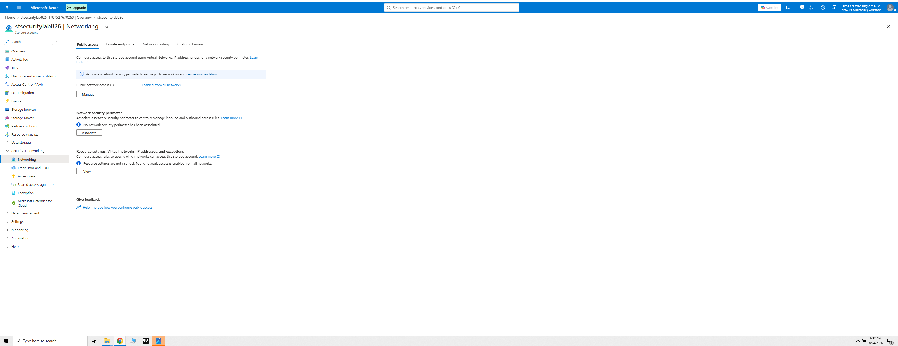

Public access was restricted to selected networks with an approved client IPv4 address.

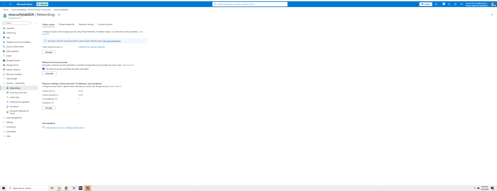

**Security result:** Reduced network attack surface while preserving required administrative access.

## 2. Shared Key Authorization

Shared Key-based authorization was enabled, providing weaker individual accountability than Entra ID and Azure RBAC.

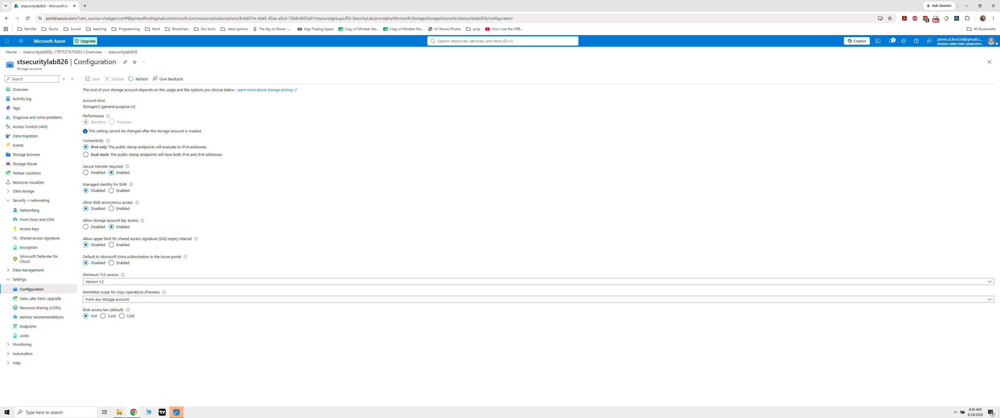

Storage account key access was disabled.

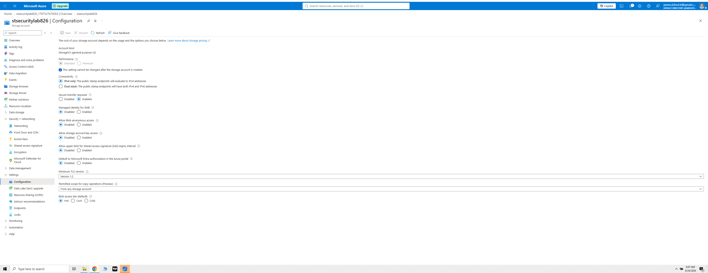

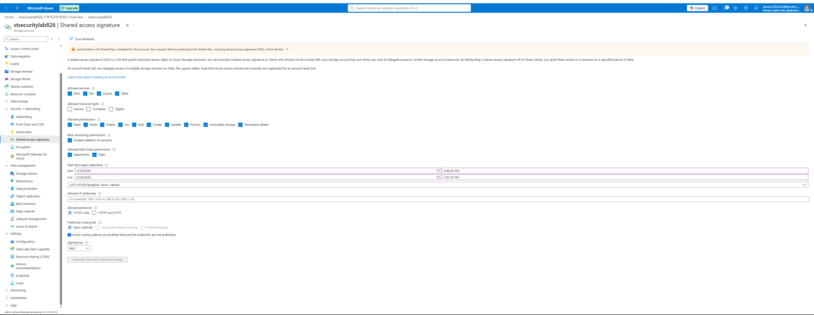

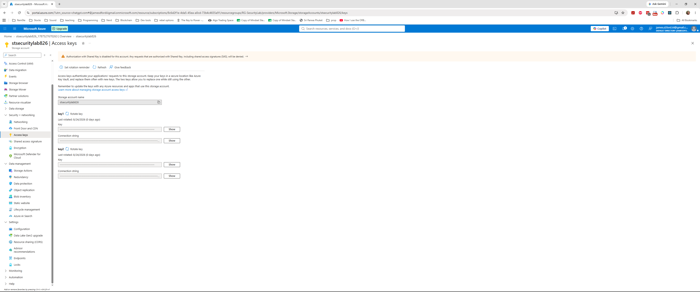

**Security result:** Reduced reliance on shared credentials and strengthened identity-based access.

## 3. Microsoft Entra Authorization

The portal was configured to prefer Microsoft Entra authorization for storage data access.

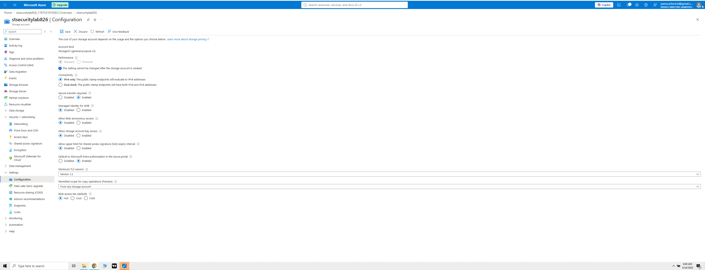

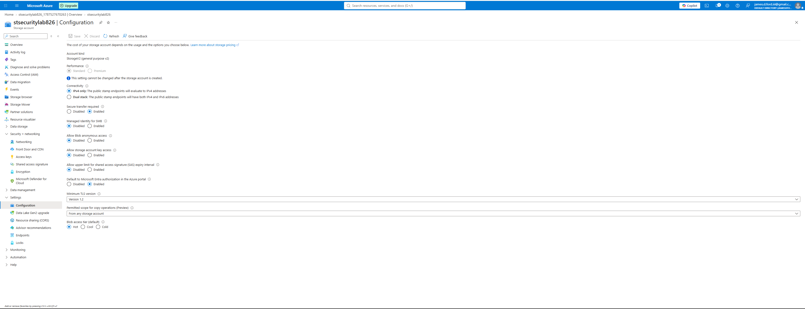

## 4. Blob Versioning & Recovery

Blob/container soft delete were already enabled, but blob versioning was disabled.

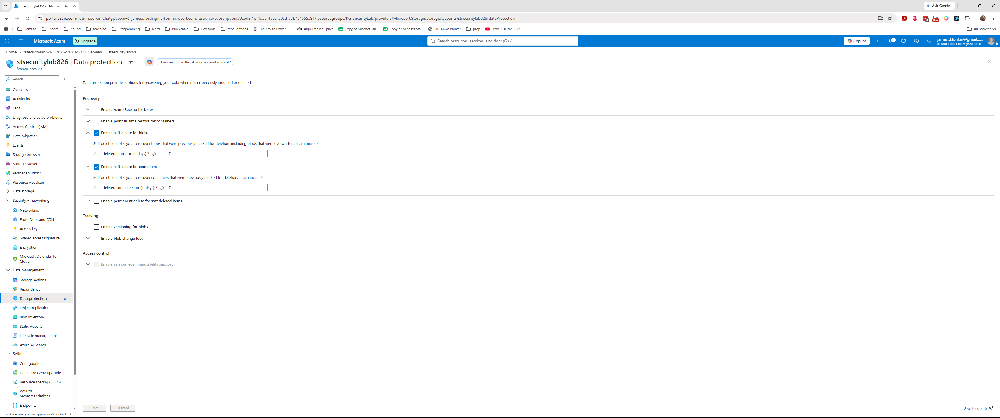

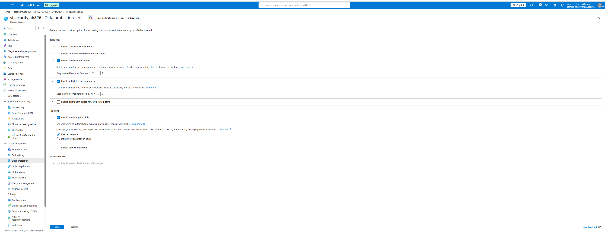

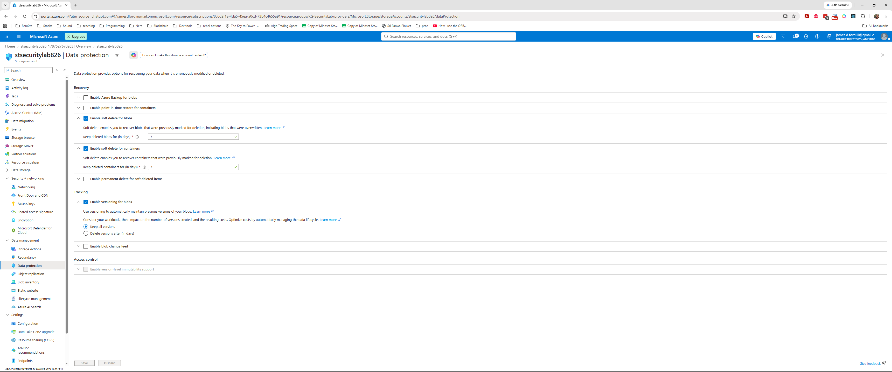

**Security result:** Improved resilience against unintended overwrite, modification, and deletion.

## 5. Identity & Least Privilege

An **Owner** role inherited at subscription scope was observed.

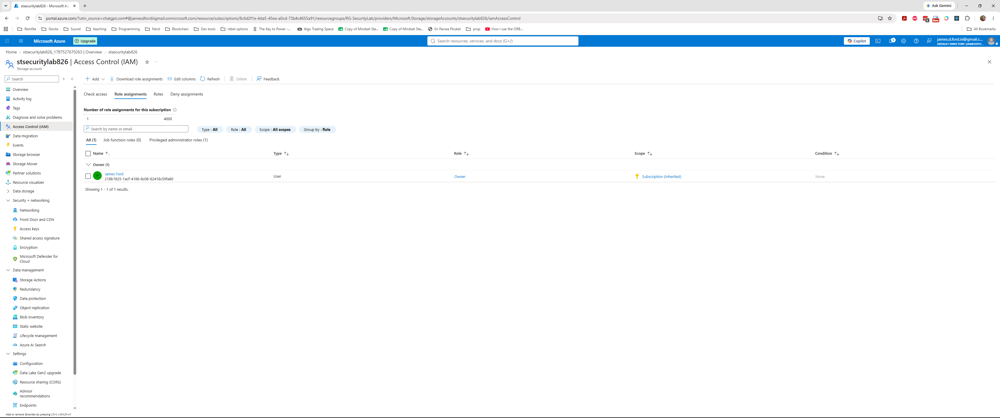

This was documented rather than removed because it was the administrative account used for the lab. In production, permanent subscription-level Owner access should be minimized.

## 6. Encryption Review

Azure Storage encryption at rest was enabled with Microsoft-managed keys, while infrastructure encryption was disabled.

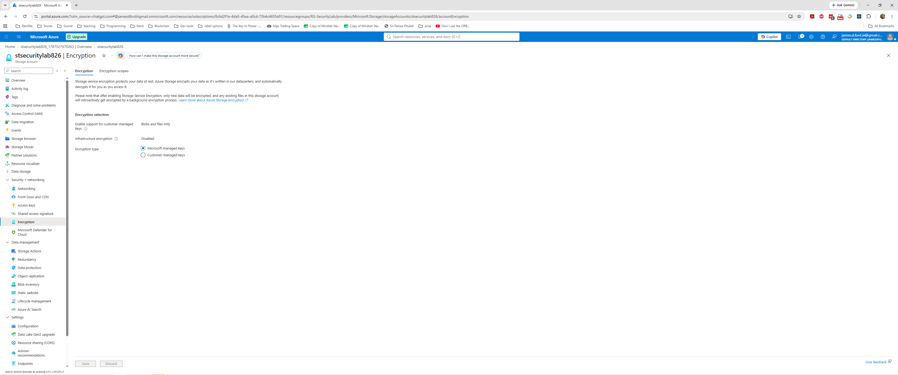

This was treated as a low-risk defense-in-depth observation rather than evidence that storage was unencrypted.

## 7. Microsoft Defender for Storage

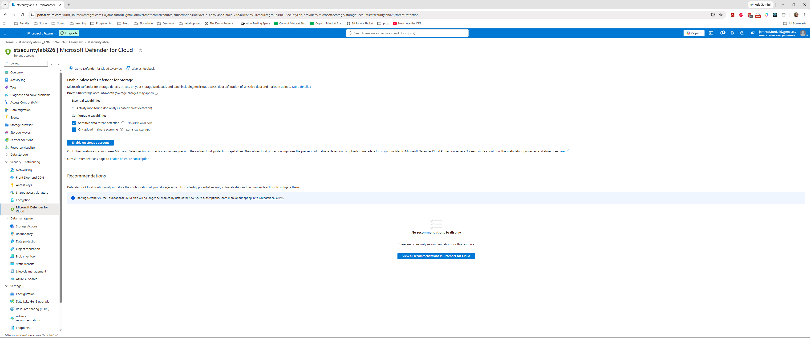

Defender for Storage was documented but not enabled because it introduced ongoing paid cost. In production, enable it where threat model and business requirements justify the expense.

## 8. Diagnostic Logging

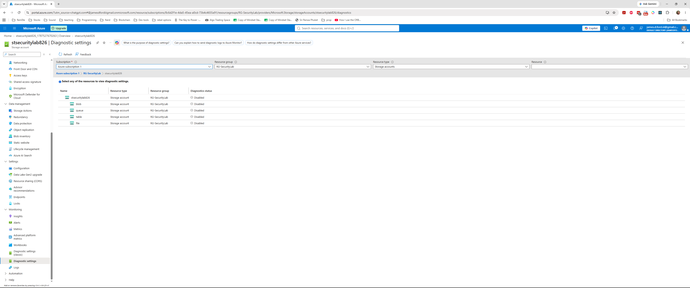

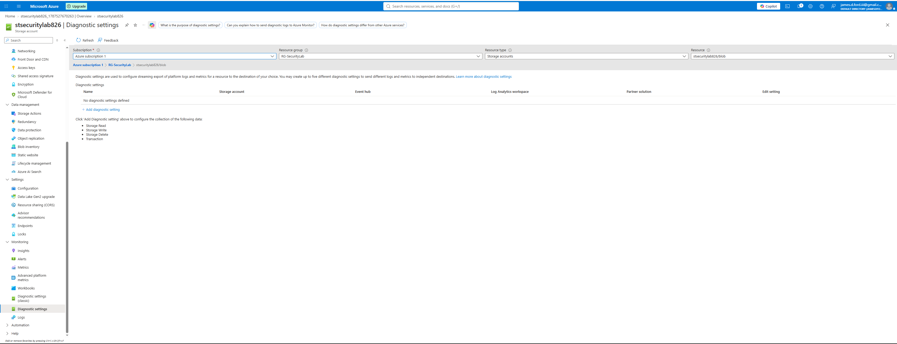

The remediation path was investigated, but a Log Analytics workspace was not available in the subscription. Production environments should route appropriate diagnostics to an approved centralized monitoring destination.

## 9. Resource Deletion Protection

The storage account initially had no resource locks.

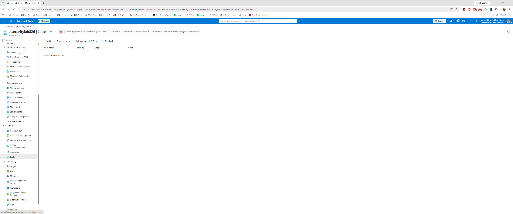

A Delete lock named `Prevent-Storage-Deletion` was configured and verified.

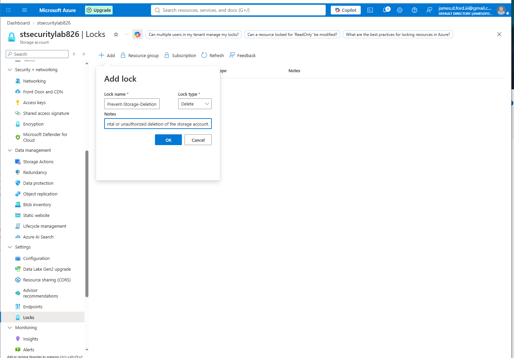

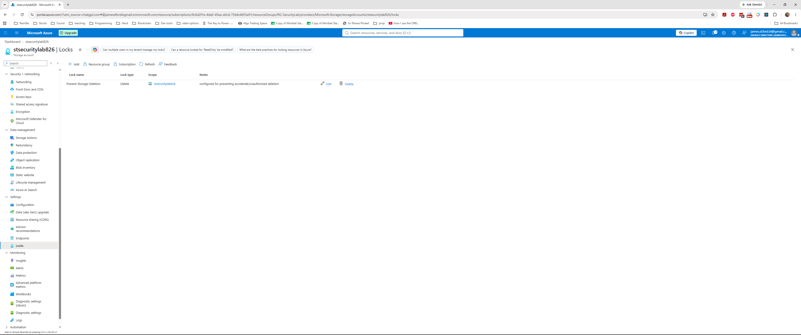

## 10. Azure Advisor Verification

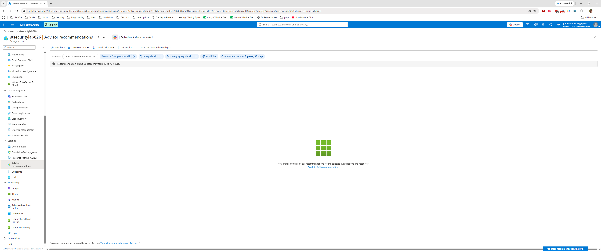

Advisor displayed no active recommendations at verification time and was treated as supplementary rather than primary validation evidence.

# Controls That Passed Review

- Secure transfer required
- Minimum TLS version 1.2
- Blob anonymous access disabled
- Blob soft delete enabled
- Container soft delete enabled
- Encryption at rest enabled with Microsoft-managed keys
- Access keys masked and protected

Not every setting should be classified as a vulnerability, and not every available security feature is mandatory for every workload.

# Remediation Summary

Implemented changes:

- Restricted storage network access
- Disabled Shared Key authorization
- Enabled Microsoft Entra authorization as portal default
- Enabled blob versioning
- Added a Delete resource lock

Documented but not implemented:

- Reduction of inherited subscription-level Owner access
- Infrastructure encryption
- Microsoft Defender for Storage
- Centralized diagnostic export to Log Analytics

# What I Learned

- **Public network exposure and anonymous access are separate security concerns.** Authentication can protect a publicly reachable service, while network restrictions independently reduce attack surface.
- **Identity-based authorization improves accountability.** Microsoft Entra ID and Azure RBAC provide more granular, attributable access than relying on shared storage account credentials.
- **Data protection requires multiple layers.** Soft delete and blob versioning address different recovery scenarios and work together to improve resilience.
- **Cloud security monitoring must be intentionally designed.** Deploying a resource does not automatically mean the telemetry required for investigation is being centralized or retained.
- **Hardening is a risk decision, not a checklist exercise.** Controls such as Defender for Storage, infrastructure encryption, private access, logging, and privileged-role reduction must be evaluated against risk, architecture, operations, and cost rather than enabled blindly.

# Skills Demonstrated

- Azure Storage security assessment
- Azure networking and storage firewall review
- Microsoft Entra ID authorization concepts
- Azure RBAC and least-privilege analysis
- Shared Key and SAS security analysis
- Cloud data-protection controls
- Blob versioning and soft-delete analysis
- Encryption configuration review
- Azure diagnostic settings assessment
- Microsoft Defender for Cloud awareness
- Azure resource locks and governance
- Risk classification and remediation prioritization
- Security control validation
- Cloud security documentation

## Security Notes

This repository contains lab evidence only. Credentials, storage account keys, connection strings, SAS tokens, and other secrets were not intentionally exposed or committed. Screenshots were captured with secrets masked.

## Project Outcome

This project demonstrates a complete Azure security-assessment workflow: review the baseline, identify security and governance gaps, assess risk, apply targeted remediations, verify resulting configuration, and document recommendations that were not appropriate to implement in the lab.
